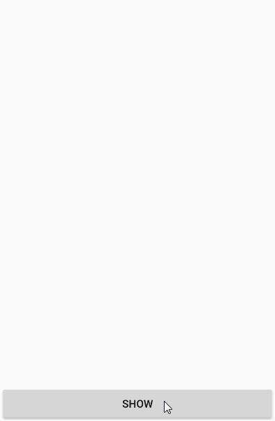

## 介绍

一个好看的加载控件

## 展示

## 使用

#####  Dialog形式

~~~java
        final RobotLoadingLayout robotLoadingLayout = (RobotLoadingLayout) View.inflate(MainActivity.this, R.layout.robot_loading_layout, null);
        final Dialog dialog = new Dialog(MainActivity.this, R.style.FullScreenDialog);
        dialog.setCancelable(true);
        dialog.setCanceledOnTouchOutside(true);
        dialog.setContentView(robotLoadingLayout);
        dialog.show();
        robotLoadingLayout.startLoading();
        robotLoadingLayout.setBottomText("人工智能测算中...");

        new Thread(new Runnable() {
            @Override
            public void run() {
                try {
                    Thread.sleep(8000);
                } catch (InterruptedException e) {
                    e.printStackTrace();
                }

                runOnUiThread(new Runnable() {
                    @Override
                    public void run() {
                        robotLoadingLayout.close(new RobotLoadingLayout.CloseListener() {
                            @Override
                            public void close() {
                                if (dialog.isShowing()) {
                                    dialog.dismiss();
                                }
                            }
                        });
                    }
                });
            }
        }).start();
~~~

##### 中间圈圈单独使用

~~~xml
<com.vice.robotloadinglib.RobotLoadingView
        android:id="@+id/robot_loading"
        android:layout_width="wrap_content"
        android:layout_height="wrap_content" />
~~~

~~~xml
    <!--人工智能测算的loading框-->
    <declare-styleable name="RobotLoadingView">
        <!--外圈颜色-->
        <attr name="outRingColor" format="color" />
        <!--外圈渐变开始颜色，会使outRingColor失效-->
        <attr name="outRingGradientStartColor" format="color" />
        <!--外圈渐变结束颜色-->
        <attr name="outRingGradientEndColor" format="color" />
        <!--外圈总宽度-->
        <attr name="outRingWidth" format="integer" />

        <!--内圈颜色-->
        <attr name="inRingColor" format="color" />
        <!--内圈渐变开始颜色，会使inRingColor失效-->
        <attr name="inRingGradientStartColor" format="color" />
        <!--内圈渐变结束颜色-->
        <attr name="inRingGradientEndColor" format="color" />
        <!--内圈每个小块的宽度-->
        <attr name="inRingEachWidth" format="integer" />
        <!--内圈每个小块的高度-->
        <attr name="inRingEachHeight" format="integer" />
        <!--内圈每个小块之间的间隔-->
        <attr name="inRingEachSpacing" format="integer" />
        <!--内圈旋转方向-->
        <attr name="inRingRotateDirection" format="enum">
            <!--顺时针-->
            <enum name="CW" value="1" />
            <!--逆时针-->
            <enum name="CCW" value="0" />
            <!--不转-->
            <enum name="N" value="-1" />
        </attr>
        <!--内圈转的时间间隔(毫秒)-->
        <attr name="inRingRotateInterval" format="integer" />
        <!--内圈单位时间转的距离-->
        <attr name="inRingRotateIntervalDegree" format="integer" />

        <!--中心文字相关-->
        <attr name="centerTextColor" format="color" />
        <attr name="centerTextSize" format="integer" />
        <attr name="centerText" format="string" />
    </declare-styleable>
~~~

